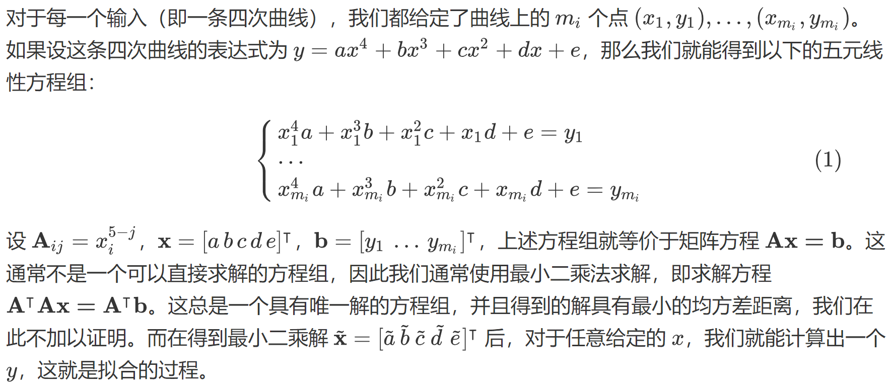

# 芃芃爱的四次方（Very Impressive Kurve Interpolation）

## 问题背景

又到了每年 n 度的 XX 情人节，芃芃想在礼物上画一个爱心。他试着自己手画了几个，要么左大右小，要么左小右大，总是不够整齐；但是拿现成的图案的话，又显得自己不够诚意。机智的芃芃想到用激光雕刻一个永远无法磨灭的爱心上去，于是他来到了天空工场。场长告诉芃芃，雕刻的图案必须是矢量图，机器才能正确地计算运动轨迹；并且由于技术上的限制，原图只能由若干条四次曲线组合而成。芃芃心生一计：我先画一个爱心的草图，把它分成几段，在每段上选几个点，把它们拟合成一条四次曲线，最后连接起来，不就可以得到一个又对称又有诚意的爱心了吗！不幸的是，因为跳级太猛，芃芃忘记了去年学过的线性代数。他找到了你，希望你可以用最小二乘法帮他把解算出来。

## 问题描述

你需要编写一个 Python 程序完成 JSON 文件的读写，根据输入的各个点，采用最小二乘法算出四次曲线的参数，然后输出。具体来说，你需要修改项目中的 `fitting.py`，并完成以下功能：

1. 读取 JSON 文件（路径为sys.argv[1]），得到在这条四次曲线上的几个点的坐标（输入中 "points" 数组的内容）
2. 按照最小二乘法（下面提供了描述），拟合出一个四次曲线
3. 把输入数据中指定的点（输入中 "predict" 数组的内容）作为 x 坐标代入拟合出来的四次曲线，然后把拟合出来的坐标**按照输入顺序**输出到 JSON 文件（路径为 sys.argv[2]）。我们不对此 JSON 文件的格式做额外要求，只需要它能够被程序读取即可。

项目中的 `fitting.py` 已经提供了必要的代码和提示，已经提供了部分输入和输出的代码以供参考。和之前的题目一样，可以通过执行 `python3 fitting.py [input_file] [output_file]` 来进行数据的处理，但注意不要把 `data` 目录下的文件覆盖。

如果你不知道如何用最小二乘法进行曲线拟合，下面是一段简单的描述（在 VS Code 或 Typora 等软件中可查看渲染后的数学公式）：

对于每一个输入（即一条四次曲线），我们都给定了曲线上的 $m_i$ 个点 $(x_1, y_1), \dots, (x_{m_i}, y_{m_i})$。如果设这条四次曲线的表达式为 $y=ax^4+bx^3+cx^2+dx+e$，那么我们就能得到以下的五元线性方程组：

$$
\begin{cases}
x_1^4a+x_1^3b+x_1^2c+x_1d+e=y_1 \\
\cdots \\
x_{m_i}^4a+x_{m_i}^3b+x_{m_i}^2c+x_{m_i}d+e=y_{m_i}
\end{cases}
$$

设 $\mathbf{A}_{ij}=x_{i}^{5-j}$，$\mathbf{x}=[a\,b\,c\,d\,e]^\intercal$，$\mathbf{b}=[y_1\,\dots\,y_{m_i}]^\intercal$，上述方程组就等价于矩阵方程 $\mathbf{Ax=b}$。这通常不是一个可以直接求解的方程组，因此我们通常使用最小二乘法求解，即求解方程 $\mathbf{A^\intercal Ax=A^\intercal b}$。这总是一个具有唯一解的方程组，并且得到的解具有最小的均方差距离，我们在此不加以证明。而在得到最小二乘解 $\tilde{\mathbf{x}}=[\tilde{a}\,\tilde{b}\,\tilde{c}\,\tilde{d}\,\tilde{e}]^\intercal$ 后，对于任意给定的 $x$，我们就能计算出一个 $y$，这就是拟合的过程。

如果阅读 LaTeX 格式的数学公式有困难，可以到 GitHub 上查看下面的图片：

## 样例与评分

我们在 `data` 目录下提供了四组数据，分别对应不同的曲线，这次正式评测不会使用额外的数据。和之前的题目一样，你可以通过 `python3 grade.py` 来进行一次的本地测评。

评测程序会读取你的程序的输出，与正确答案进行对比。并且按照你的输出绘制出一个图形，当你实现正确时，应该可以得到心型图案。

由于浮点运算存在误差，我们允许你的输出与标准答案相比有一定的差异，具体可见 `grade.py` 中的相关判断。

这次数据量很小，虽然仍然设置了 2s 的时间限制，但基本不会达到。

最终分数构成为：

* 黑盒 80 分：共 4 个测例，每个 20 分
* 白盒 20 分：代码风格与 Git 使用 20 分（包括恰当注释、合理命名、提交日志等）

助教以 deadline 前 GitHub 上最后一次提交为准进行评测。

## 提示

1. 矩阵的转置可以通过 `A.T` 或者 `A.transpose()` 来得到
2. 矩阵的逆可以通过 `np.linalg.inv` 来得到

